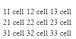
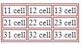
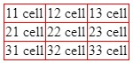
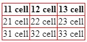

# Introduction
In this repository will be shown some elements to modify style text in HTML, such as bold and italic text. Also, some elements to edit a text, such as a single break line, unordered and ordered list, tables, lines...

## Bold text
```html
<p>Example of <strong>bold</strong> text</p>
```
## Break line
```html
<br>
```
## Horizontal line
```html
<hr>
```
## Ordered list
```html
<ol>
    <li>Some text</li>
    <li>Another text</li>
    <li>Some example</li>
</ol>
```
## Unordered list
```html
<ul>
    <li>Some text</li>
    <li>Another text</li>
    <li>Some example</li>
</ul>
```

## Group elements
Two or more elements are grouped with <code> \<div\>\</div\> </code> label.
```html
<div>
    <p>Lorem ipsum dolor sit, amet consectetur adipisicing elit. Iure iste perferendis ipsam voluptas qui vitae ducimus ipsa pariatur, sed cum consectetur inventore id laboriosam assumenda iusto saepe corporis molestiae eligendi.</p>
    <p>Lorem ipsum dolor sit amet consectetur, adipisicing elit. Libero dolor doloremque assumenda ipsa ullam ea, dolorum consequuntur optio autem quo tenetur repellendus, facere mollitia? Asperiores dignissimos nihil repellendus cum architecto?</p>
</div>
```
## Inline elements
The <code>\<spam\>...\</spam\></code> is used to group part of the content of an element to apply styles.
```html
<p>Lorem, ipsum dolor sit <span>amet consectetur adipisicing</span> elit. Minima at blanditiis id enim molestiae ex! Mollitia, voluptatum? Esse debitis quam libero ad fugit voluptatibus ab. Porro unde a maxime pariatur! Lorem, ipsum dolor sit amet consectetur adipisicing elit. Nesciunt <span>aperiam iste at minima itaque</span> quaerat sapiente fugit saepe suscipit. Iusto natus voluptatibus molestias architecto possimus pariatur repellat culpa autem rem.</p>
```

# Tables

## Table structure in HTML
```html
<table>
    <tr> <!--Row-->
        <td>  <!--Column or cel-->
            11 cell
        </td>
        <td>12 cell</td>
        <td>13 cell</td>
    </tr>
    <tr>
        <td>21 cell</td>
        <td>22 cell</td>
        <td>23 cell</td>
    </tr>
    <tr>
        <td>31 cell</td>
        <td>32 cell</td>
        <td>33 cell</td>
    </tr>
</table>
```


### Table's border, style border and color border
```css
table,tr,td{
    border: 1px solid red;
}
```


### Single line in table borders.
```css
table,tr,td{
    border: 1px solid red;
    border-collapse: collapse;
}
```


## Table headers

The code <code>\<th\>...\</th\></code> adds the table headers. However, to show header line in the table, the <code>th</code> label may be added.
HTML code is
```html
<table>
    <tr> <!--Row-->
        <th>  <!--Column or cel-->
            11 cell
        </th>
        <th>12 cell</th>
        <th>13 cell</th>
        </tr>
```
and CSS code is
```css
table,tr,td,th{
    border: 1px solid red;
    border-collapse: collapse;
}
```


## Merge cells

the code <code>\<td colspan="2"\>32 cell\</td\></code> merges two columns
```html
    <table>
        <tr> <!--Row-->
            <th>  <!--Column or cel-->
                11 cell
            </th>
            <th>12 cell</th>
            <th>13 cell</th>
        </tr>
        <tr>
            <td>21 cell</td>
            <td>22 cell</td>
            <td>23 cell</td>
        </tr>
        <tr>
            <td>31 cell</td>
            <td colspan="2">32 cell</td>
        </tr>
    </table>
```


