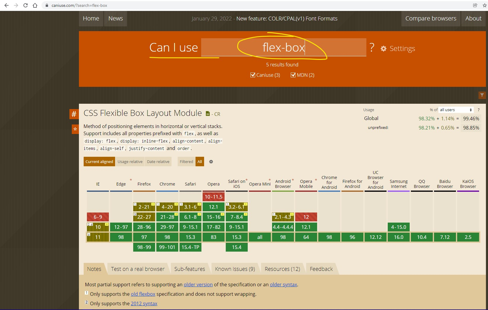

# Introduction
Some link tutorial in [w3schools](https://www.w3schools.com/css/css3_flexbox.asp)

## Flexbox

* <code>display: flex</code>  Used to enable flexbox. 
* <code>margin: 10px</code> Distance between blocks
* <code>border: 1px solid blue;</code> Border around the block
* <code>justify-content: flex-end;</code> Justify content to right. Other options are:
  * flex-start
  * center
  * space-between
  * space-around
* <code>align-items: center;</code> Border around the block
* <code>flex-wrap: wrap;</code> Border around the block
* 

## Results

