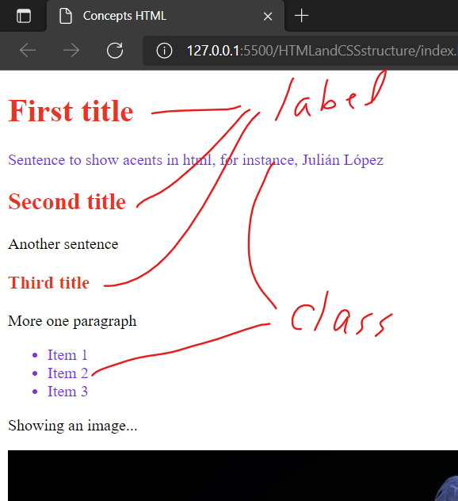
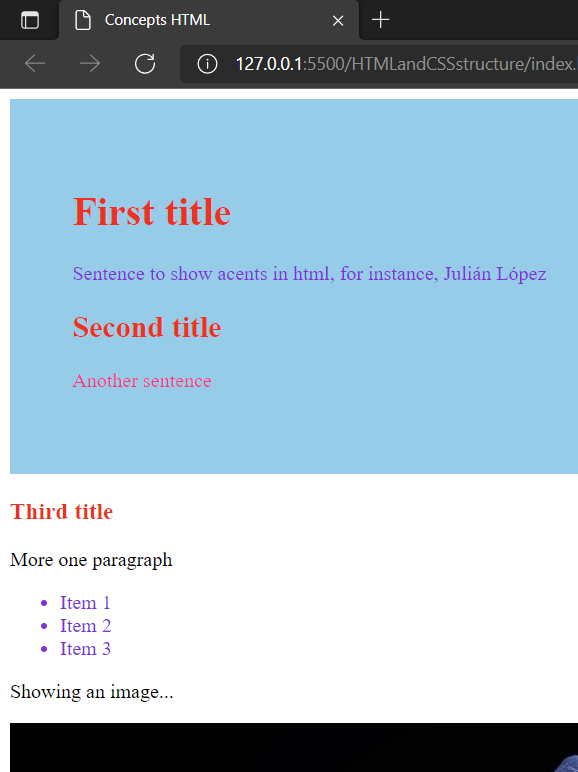

# Structure of a HTML and CSS files

# Estructure without styles


# Adding styles in the html file
Styles may be added ussing selectors or class
```html
<head>
    <title>Concepts HTML</title>
    <style>
        h1, h2{
            color: blue;
        }
        h3{
            color:red;
        }
        
        .paragraph{  /*Class paragraph.*/
            color: blueviolet;
        }
    </style>
</head>
```


# Adding styles in CSS file (styles.css)
Styles are added ussing labels and/or class.
* Import the <code>styles.css</code> in the html file
* Ussing labels <code>id="title"</code>
* Ussing class <code>class="paragraph"</code>

Following code shows an example of labels and class to reference styles in html file.
```html
<head>
    <title>Concepts HTML</title>
    <link rel="stylesheet" href="styles.css">
</head>
<body>
    <h1 id="title">First title</h1>    <!--title label-->
        <p class="paragraph">Sentence to show acents in html, for instance, Julián López</p>   <!--Paragraph label-->
    <h2 id="title">Second title</h2>
        <p>Another sentence</p>
    <h3 id="title">Third title</h3>
        <p>More one paragraph</p>
        <ul class="paragraph">  <!--Unordered list-->
            <li>Item 1</li> 
            <li>Item 2</li>
            <li>Item 3</li>
        </ul>
    <p>Showing an image...</p>
    
</body>
```
And the following code shows the label and class in the css file:

```css
.paragraph{  /*Class paragraph.*/
    color: blueviolet;
}
#title {
    color: red;
}
```




# Grouping HTML elements using DIV

HTML file
```html
<div class="group">
    <h1 id="title">First title</h1>    <!--title label-->
    <p class="paragraph">Sentence to show acents in html, for instance, Julián López</p>   <!--Paragraph label-->
    <h2 id="title">Second title</h2>
    <p>Another sentence</p>
</div>
```

CSS file
```css
.group{     /*Class group*/
    background-color: skyblue;
    padding: 50px;
    color:deeppink;
}
.paragraph{  /*Class paragraph*/
    color: blueviolet;
}
#title {
    color: red;
}
```


