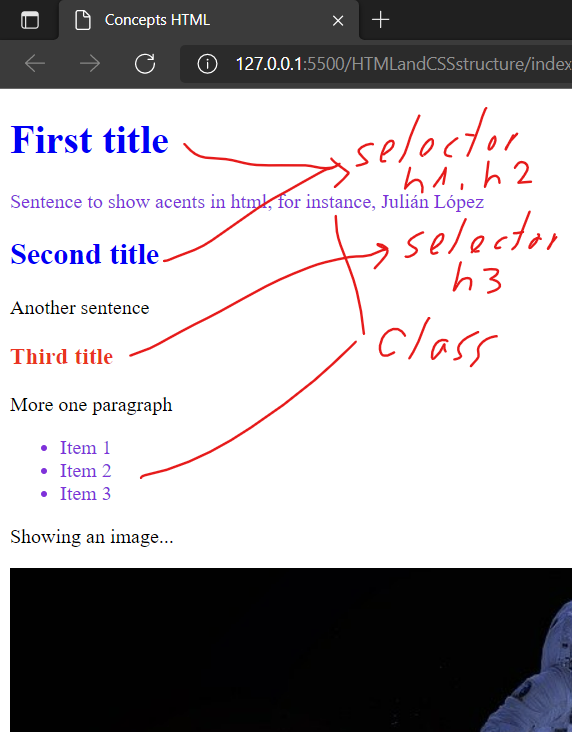

# Structure of a HTML and CSS files

## Estructure without styles


## Adding styles in the html file
Styles may be added ussing selectors or class
```html
<head>
    <title>Concepts HTML</title>
    <style>
        h1, h2{
            color: blue;
        }
        h3{
            color:red;
        }
        
        .paragraph{  /*Class paragraph.*/
            color: blueviolet;
        }
    </style>
</head>
```

