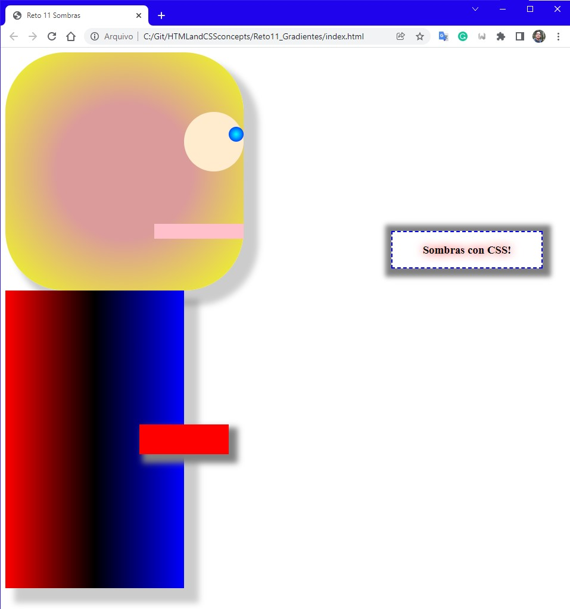

# Introduction

Challenge

Challenge's image wasn't upload by MakeItReal

Answer

Figure porpoised to test gradient properties.


HTML code
```html
<body>
    <div class="containerGeral">
        <div class="containerHead">
            <div class="containerEye">
                <div class="boxIris"></div>
            </div>
            <div class="boxMouth"></div>
        </div>
        <div class="containerBody">
            <div class="boxArm"></div>
        </div>
        <div class="boxText">
            <h3>Sombras con CSS!</h3>
        </div>
    </div>
</body>
```

CSS code
```css
.containerGeral{
    background-color: white;
    position: relative;
    height: 900px;
}

.containerHead{
    background-color: cadetblue;
    height: 400px;
    width: 400px;
    position: absolute;
    box-shadow: 20px 20px 10px 5px rgba(0, 0, 0, 0.2);
    background: radial-gradient(rgb(219, 155, 155) 40%,rgb(240, 255, 29));
    border-radius: 100px;
}

.containerEye{
    background-color: blanchedalmond;
    height: 100px;
    width: 100px;
    position: absolute;
    right: 0px;
    top: 100px;
    border-radius: 50px;
}

.boxIris{
    background-color: black;
    height: 25px;
    width: 25px;
    position: absolute;
    right: 0px;
    top: 25px;
    border-radius: 12.5px;
    background: radial-gradient(cyan, blue);
}

.boxMouth{
    background-color:pink;
    height: 25px;
    width: 150px;
    position: absolute;
    right: 0px;
    bottom: 87.5px;
}

.containerBody{
    background-color: black;
    height: 500px;
    width: 300px;
    position: absolute;
    top: 400px;
    box-shadow: 20px 20px 10px 5px rgba(0, 0, 0, 0.2);
    background: linear-gradient(to right, red, black,blue);
}

.boxArm{
    background-color: red;
    height: 50px;
    width: 150px;
    position: absolute;
    left: 225px;
    top: 225px;
    box-shadow: 10px 10px 10px 5px gray;
}

.boxText{
    border: 2px dashed blue;
    width: 250px;
    text-align: center;
    position: absolute;
    right: 40px;
    top: 300px;
    box-shadow: 2px 2px 8px 12px rgba(0, 0, 0, 0.5);
    
}

.boxText h3{
    text-shadow: 0px 0px 15px red;
}
```
