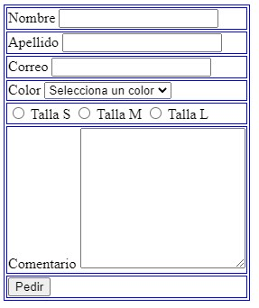

# Challenge 5 purposed by Make It Real (Formularios)

Challenge


Answer



HTML code:
```html
<body>
    <form action="actionForm">
        <table>
            <tr>
                <td>
                    <label for="firstname">Nombre</label>
                    <input type="text" id="firstname" name="name"/>
                </td>
            </tr>
            <tr>
                <td>
                    <label for="secondname">Apellido</label>
                    <input type="text" id="secondname" name="apellido"/>
                </td>
            </tr>
            <tr>
                <td>
                    <label for="correo">Correo</label>
                    <input type="text" id="correo" name="correo"/>
                </td>
            </tr>
            <tr>
                <td>
                    <label for="color">Color</label>
                    <select name="color" id="color">
                        <option value="" selected disabled hidden>Selecciona un color</option>
                        <option value="amarillo">Amarillo</option>
                        <option value="verde">Verde</option>
                        <option value="rojo">Rojo</option>
                        <option value="negro">Nero</option>
                    </select>
                </td>
            </tr>
            <tr>
                <td>
                    <input type="radio" id="radio_1" name="size_opions"/>
                    <label for="radio_1">Talla S</label>
                    <input type="radio" id="radio_2" name="size_opions"/>
                    <label for="radio_2">Talla M</label>
                    <input type="radio" id="radio_3" name="size_opions"/>
                    <label for="radio_3">Talla L</label>
                </td>
            </tr>
            <tr>
                <td>
                    <label for="comentario">Comentario</label>
                    <textarea name="comentario" id="comentario" cols="20" rows="10"></textarea>
                </td>
            </tr>
            <tr>
                <td>
                    <button type="submit">Pedir</button>
                </td>
            </tr>
        </table>
    </form>
</body>
```

CSS code:
```css
table, tr,td{
    border: 1px solid blue;
}
```