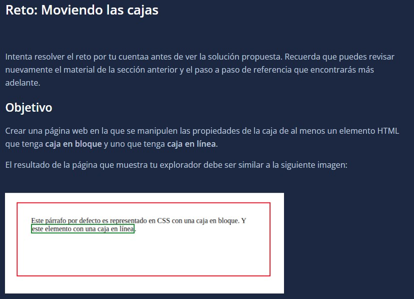
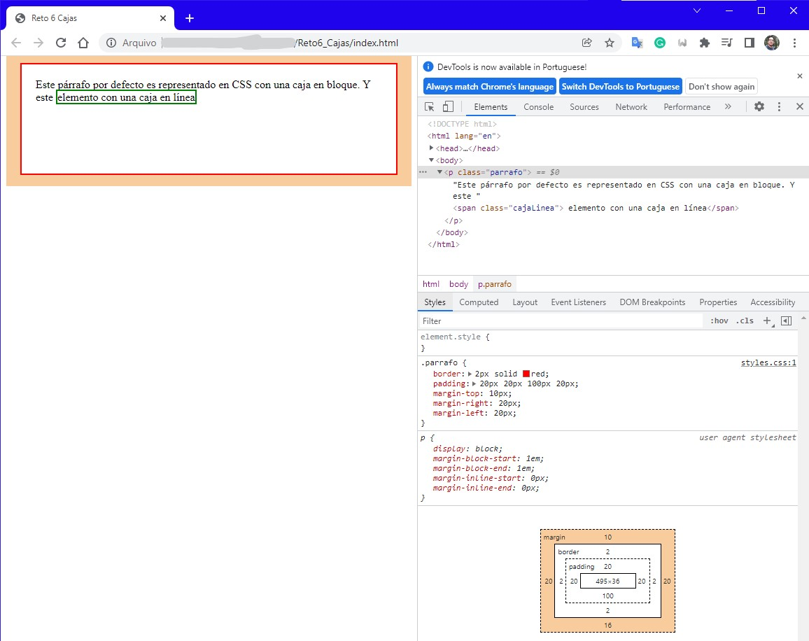

# Introduction

Challenge



Answer



# Box properties.
Some box propierties are: 

* position: relative
* position: absolute
* width: ###px
* height: ###px
* left: 300px;
* bottom: 125px;

```html
<!DOCTYPE html>
<html lang="en">
<head>
    <meta charset="UTF-8">
    <meta name="viewport" content="width=device-width, initial-scale=1.0">
    <meta http-equiv="X-UA-Compatible" content="ie=edge">
    <title>Reto 6 Cajas</title>
    <link rel="stylesheet" href="styles.css">
</head>
<body>

    <p class="parrafo">Este párrafo por defecto es representado en CSS con una caja en bloque. Y este <span class="cajaLinea"> elemento con una caja en línea</span> </p>
    
    <div class="bloqueMayor">
        <div class="bloqueMenor"></div>
        <div class="bloqueMenor2"></div>
    </div>
</body>
</html>
```

```css
.parrafo {
    border: 2px solid red;
    padding: 20px 20px 100px 20px;
    margin-top: 10px;
    margin-right: 20px;
    margin-left: 20px;
}

.cajaLinea{
    border: 2px solid green;
}

.bloqueMayor{
    background-color: red;
    width: 700px;
    height: 500px;
    position: relative;
}

.bloqueMenor{
    background-color: blue;
    width: 350px;
    height: 250px;
    position: absolute;
}
.bloqueMenor2{
    background-color: greenyellow;
    width: 350px;
    height: 250px;
    background-position-x: right;
    position: absolute;
    left: 300px;
    bottom: 125px;
}
```

