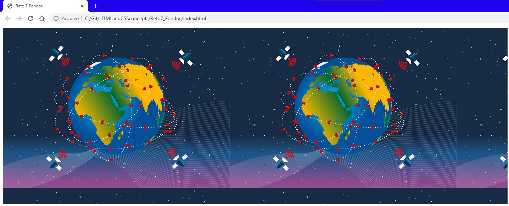
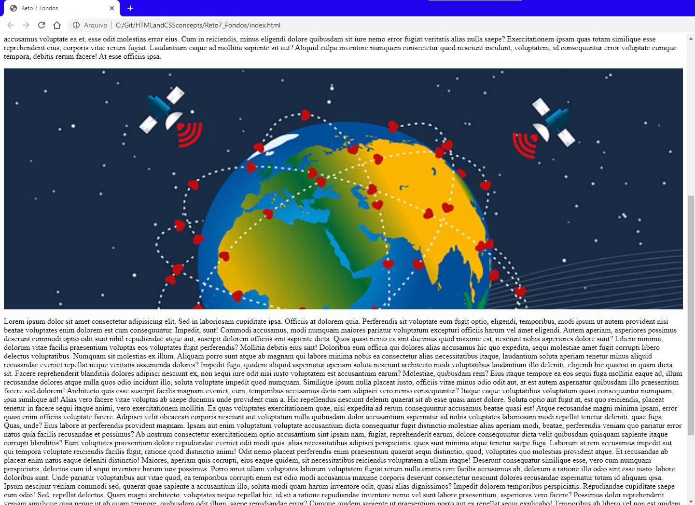

# Introduction (index_reto7.html and styles_reto7.css files)

Challenge


Answer


# Background propesties (index.html and styles.css files)

```css
.background{
    width: 100%;
    height: 500px;
    background-color: blueviolet;
    background-image: url(./figuresReadme/world-comm_640x453.png);
}
```


```css
.background{
    width: 100%;
    height: 500px;
    background-color: blueviolet;
    background-image: url(./figuresReadme/world-comm_640x453.png);
    background-repeat: no-repeat;
}
```


```css
.background{
    width: 100%;
    height: 500px;
    background-color: blueviolet;
    background-image: url(./figuresReadme/world-comm_640x453.png);
    background-position: 50% 50%;
}
```


```css
.background{
    width: 100%;
    height: 500px;
    background-color: blueviolet;
    background-image: url(./figuresReadme/world-comm_640x453.png);
    background-repeat: no-repeat;
    background-position: 50% 50%;
    background-size: 100% 100%; /*x(width) - y (heigh), units also may be cm, mm, px*/
}
```


## background-attachment

```css
.background{
    width: 100%;
    height: 500px;
    background-color: blueviolet;
    background-image: url(./figuresReadme/world-comm_640x453.png);
    background-repeat: no-repeat;
    background-position: 50% 50%;
    background-size: 100% 100%; /*x(width) - y (heigh), units also may be cm, mm, px*/
    background-attachment: fixed;
}
```


