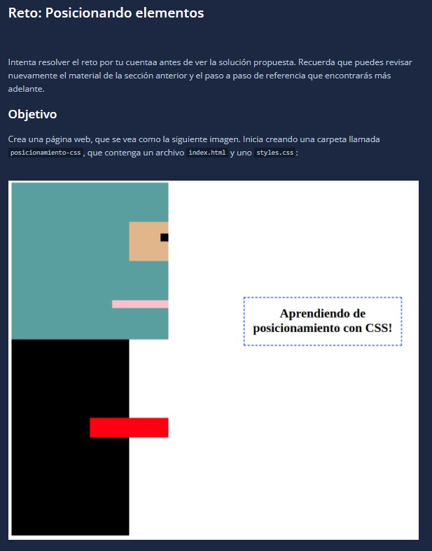

# Introduction

Challenge



Answer


HTML ile

```html
<body>
    <div class="containerGeral">
        <div class="containerHead">
            <div class="containerEye">
                <div class="boxIris"></div>
            </div>
            <div class="boxMouth"></div>
        </div>
        <div class="containerBody">
            <div class="boxArm"></div>
        </div>
        <div class="boxText">
            <h3>Aprendiendo de posicionamiento con CSS!</h3>
        </div>
    </div>
</body>
```

CSS file
```css
.containerGeral{
    background-color: white;
    position: relative;
    height: 900px;
}

.containerHead{
    background-color: cadetblue;
    height: 400px;
    width: 400px;
    position: absolute;
}

.containerEye{
    background-color: blanchedalmond;
    height: 100px;
    width: 100px;
    position: absolute;
    right: 0px;
    top: 100px;
}

.boxIris{
    background-color: black;
    height: 25px;
    width: 25px;
    position: absolute;
    right: 0px;
    top: 25px;
}

.boxMouth{
    background-color:pink;
    height: 25px;
    width: 150px;
    position: absolute;
    right: 0px;
    bottom: 87.5px;
}

.containerBody{
    background-color: black;
    height: 500px;
    width: 300px;
    position: absolute;
    top: 400px;
}

.boxArm{
    background-color: red;
    height: 50px;
    width: 150px;
    position: absolute;
    left: 225px;
    top: 225px
}

.boxText{
    border: 2px dashed blue;
    width: 250px;
    text-align: center;
    position: absolute;
    right: 40px;
    top: 300px;
}
```