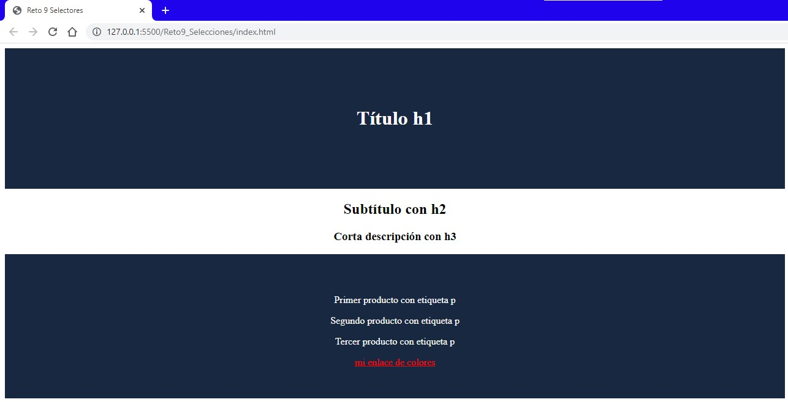

# Introduction

Challenge


Answer




```html
<body>
    <div class="container">
        <div class="boxTitle">
            <h1>Título h1</h1>
        </div>
        <div class="boxSubtitle">
            <h2>Subtítulo con h2</h2>
            <h3>Corta descripción con h3</h3>
        </div>
        <div class="boxFootNote">
            <p>Primer producto con etiqueta p</p>
            <p>Segundo producto con etiqueta p</p>
            <p>Tercer producto con etiqueta p</p>
            <a href="https://htmlcolorcodes.com/es/">mi enlace de colores</a>
        </div>
    </div>
</body>
```

```css
.boxTitle{
    background-color: #192841;
    color: white;
    margin: 0px;
    padding-top: 75px;
    padding-bottom: 75px;
    text-align: center;
}

.boxSubtitle{
    background-color: white;
    position: relative;
    margin-top: 0px;
    margin-bottom: 0px;
    text-align: center;
}

.boxFootNote{
    background-color: #192841;
    color: white;
    padding-top: 50px;
    padding-bottom: 50px;
    text-align: center;
}

/*properties of not visited link*/
.boxFootNote a:link{
    color: red;
}

/*properties of visited link*/
.boxFootNote a:visited{
    color:chartreuse;
}

.boxFootNote a:hover{
    color:darkorange;
}
```